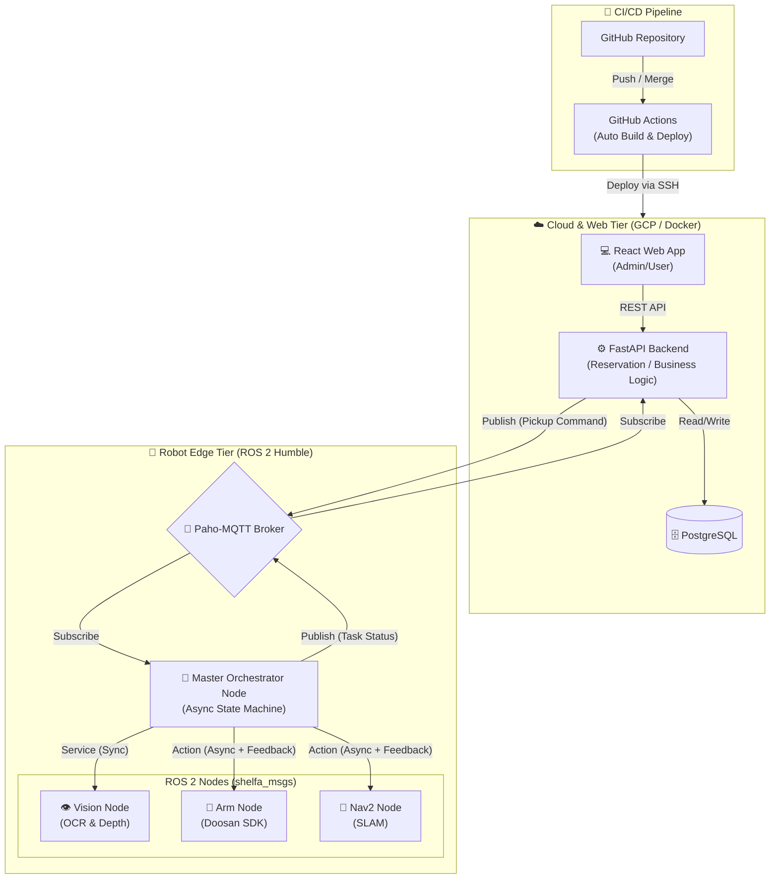

# 📚 Shelfa (하이브리드 클라우드 자율주행 도서 관리 시스템)


Shelfa는 **클라우드 웹 백엔드와 오프라인 ROS 2 로봇 시스템을 MQTT로 실시간 연동**하여, 도서관의 책을 자동으로 찾고 픽업해 주는 '자율주행 무인 도서 관리 로봇 시스템'입니다.

## 🌟 주요 기능 (Key Features)

### 1. 💻 프론트엔드 (React Web App)
* **관리자(Admin) 대시보드:** React 기반의 웹 인터페이스를 통해 원격으로 로봇에게 직접 이동/픽업 명령을 내릴 수 있는 통합 관제 시스템 구축.
* **사용자 도서 예약 앱:** 직관적인 UI를 통해 도서 상세 정보를 조회하고 실시간으로 로봇에게 책 픽업을 예약하는 모바일 친화적 뷰 제공.

### 2. ☁️ 백엔드 & 인프라 (FastAPI & DevOps)
* **하이브리드 통신망:** 클라우드 인프라(FastAPI)와 로컬 로봇 망(ROS 2)을 Paho-MQTT를 통해 실시간 비동기 제어.
* **GitHub Actions 기반 CI/CD:** 코드가 Push 되면 GitHub Actions가 자동으로 GCP 서버의 Docker 컨테이너를 재시작하는 무중단 배포 파이프라인 구축.
* **무중단 데이터 마이그레이션:** 배포 시 기존 DB 스키마 꼬임 현상을 방지하기 위해 `ALTER TABLE` 및 일괄 동기화 API를 통한 Zero-Downtime Migration 수행.

### 3. 🦾 로봇 팔 제어 및 매니퓰레이션 (Doosan e0509 & Gripper)
* **정밀 궤적 제어 (Spline Task):** 두산 로봇(e0509) SDK를 활용하여, 책장 사이의 좁은 공간에서도 충돌 없이 부드럽게 파지(Grasping)할 수 있도록 Spline 보간법 기반의 이동 궤적(Waypoints) 제어 로직 구현.
* **그리퍼(Gripper) 연동:** 파지 대상 도서의 두께와 재질을 고려하여 로봇 팔의 Servo J 명령과 그리퍼 개폐 타이밍을 정밀하게 동기화.
* **모방 학습(Imitation Learning) 데이터 파이프라인:** (진행 중) VR 텔레오퍼레이션 및 조그 제어를 통해 사람의 실제 픽업 동작 데이터를 수집하고, 이를 딥러닝 기반 모방 학습 모델에 적용하기 위한 환경 구축.

### 4. 👁️ 비전 및 딥러닝 시스템 (Vision & OCR)
* **책등(Spine) 기반 도서 인식:** 도서관 책장에 꽂힌 수많은 책 중에서 타겟 도서를 찾기 위해, 이미지 크롭 및 해상도 최적화(960px)를 거친 후 OCR(광학 문자 인식) 모델을 적용하여 책 제목 추출.
* **정밀 위치 보정 (Depth & ArUco):** 2D 이미지만의 한계를 극복하기 위해 Depth 카메라 데이터로 Segmentation을 수행하고, 파지 직전 ArUco 마커를 인식하여 그리퍼와 책 사이의 오차(Alignment)를 mm 단위로 보정.

---

## 🏗️ 전체 구조도 (System Architecture)

시스템의 유연성과 확장성을 위해 모놀리식 구조를 탈피하고, 클라우드와 로봇 엣지(Edge)가 MQTT로 분리된 **마이크로서비스 및 분산 아키텍처**를 채택했습니다.



---

## 🚀 시작하기 (Getting Started)

본 프로젝트는 의존성 문제를 해결하기 위해 백엔드와 ROS 2 코어 환경을 모두 **Docker Compose**로 컨테이너화하여 제공합니다.

### 1. 백엔드 및 MQTT 인프라 실행
```bash
cd backend
docker-compose up -d --build
```

### 2. ROS 2 마스터 노드 실행
```bash
docker exec -it ros2_core bash
source /opt/ros/humble/setup.bash
source /ros2_ws/install/setup.bash
ros2 run master_orchestrator master_node
```